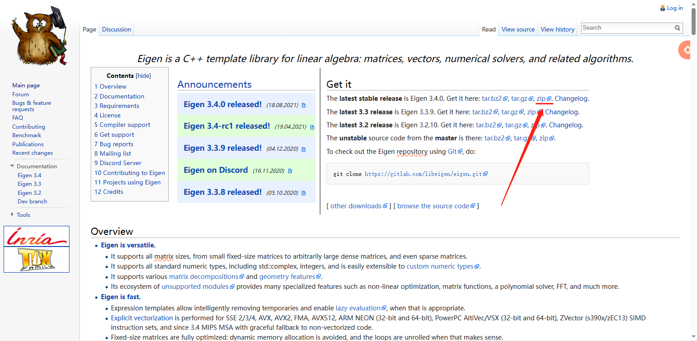
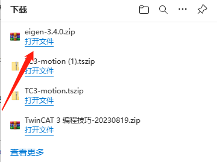
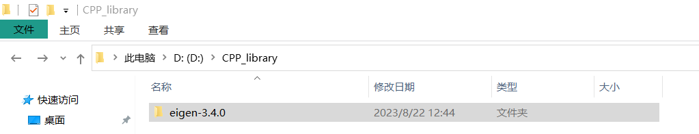
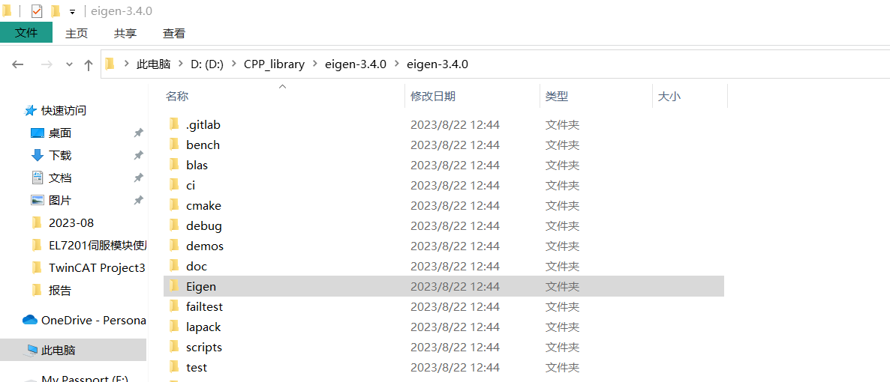
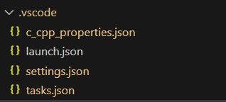
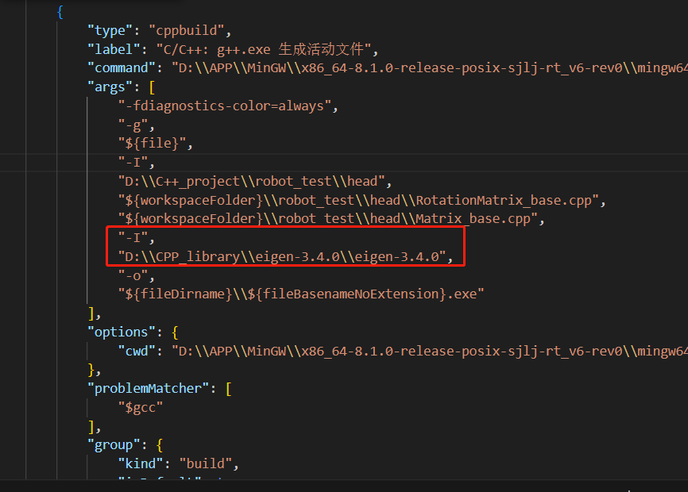
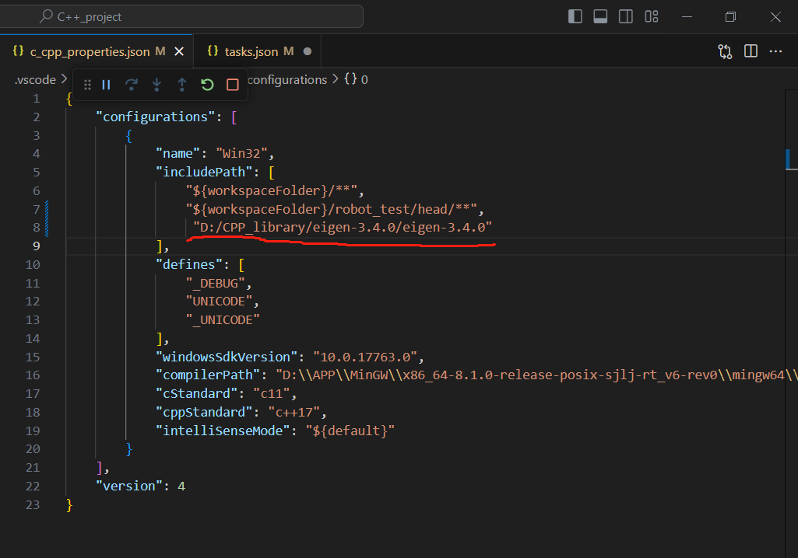
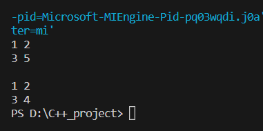

# 全网最清晰简洁安装Eigen库方法(Win10+VScode)

[toc]

## Eigen库介绍

Eigen是一个用于线性运算的C++ 模板库，支持 矩阵和矢量运算，数值分析及其相关的算法。

## 参考文章

[快速入门矩阵运算——开源库Eigen](https://zhuanlan.zhihu.com/p/293023673)

## 具体安装方法（前置太长不看，可直接点击此处跳转）

### 0.前置环境

1.安装Vscode及配置C++基础运行环境
具体安装可参考以下文章
[VsCode安装和配置c/c++环境（超完整，小白专用）](https://blog.csdn.net/weixin_48468423/article/details/118950592)

### 1. Eigen库下载

#### 1.1 进入Eigen官网

<http://eigen.tuxfamily.org/index.php?title=Main_Page>

#### 1.2 下载库压缩包

* 点进官网链接后如下图所示

<div align=middle ,></div>

* 单击红色箭头所指的zip格式链接，可能会等待一下，浏览器会显示下载压缩包(笔者下载时是3.4.0版本)

<div align=middle ,></div>

* 将该压缩包解压，并自行存放一个路径，如图为笔者所存放路径

<div align=middle ,></div>

* 文件存放好后，点进去后会发现里面有个同名的文件夹，没关系，再点进去，可看到其文件结构如图所示

<div align=middle ,></div>

### 2. 配置vscode

经过前置环境搭建，新建的C++环境中可看到.vscode中的以下文件(launch.json没有没关系)

<div align=middle ,></div>

* 打开tasks.json文件，添加以下代码

```json
"-I",
"Eigen路径(注意双斜杠)"
```

<div align=middle ,></div>

>注：可以看到在args里有两条"-I",因为这个项目里我还包含了一些自己写的库，所以本身就自带一个“-I”，对于不是很熟悉C++编译的同学很容易被这里坑，由于这个笔者一开始以为"-I"有一句就行，路径直接跟在第一个“-I”后面，所以一直报错。（该问题在网上教程中基本没找到，哎）

* 打开c_cpp_properties.json文件，添加以下代码

```json
"Eigen路径(注意斜杠)"
```

<div align=middle ,></div>

* 该条语句是检查语法用的，不加可能语句会标红，但编译会通过。

### 3. 测试代码

```C++
#include <iostream>
#include <Eigen/Dense>
using namespace Eigen;
using namespace std;

int main()
{
  ArrayXXf  m(2,2);
  
  // assign some values coefficient by coefficient
  m(0,0) = 1.0; m(0,1) = 2.0;
  m(1,0) = 3.0; m(1,1) = m(0,1) + m(1,0);
  
  // print values to standard output
  cout << m << endl << endl;
 
  // using the comma-initializer is also allowed
  m << 1.0,2.0,
       3.0,4.0;
     
  // print values to standard output
  cout << m << endl;
  
    getchar();
}
```

### 4. 运行效果

通过以上步骤即可编译运行，效果如下：

<div align=middle ,></div>
