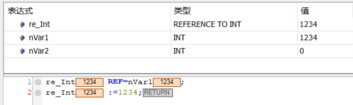

# ST(结构化文本)

## 目录

[toc]

## 参考资料

* 《TC3_IEC_CH》
* <https://infosys.beckhoff.com/(此网站为倍福信息系统，大部分所需信息都能在该网站找到)>

## 备注

* 语法标准：IEC61131-3
* 前缀:用于增强程序可读
* 命名规范1:匈牙利标记法：子字符串写成一个单词，每个子字符串的第一个字母大写

## 基础知识点

### 变量声明格式

```C
变量名:数据类型:=赋值;
```

### 变量命名规则

**变量名的命名规则同C语言类似;**

* 标识符以字母或下划线开头
* 后跟数字，字母和下划线

**不允许出现以下情况：**

* 特殊字符(!,",$等)
* 空格
* 连续下划线
* 变音符号等
* 功能块命名同样须遵循此规则

**区别：**

* 不区分大小写(abc与ABC表示同一个变量)
* 不能有连续的下划线(a__b)

---

### 注释

**单行:**
单行注释可以用 ==//== 表示
**多行:**
以 ==(*== 开始, 以 ==*)== 结束

### 数据类型

#### 整型

数据类型|最小值|最大值|数据位数|前缀(Prefix)|备注|
-|-|-|-|-|-|
BOOL|FALSE|TRUE|1位|x/b|
BYTE|0|255|8位|n|
WORD|0|65535|16位|n|
DWORD|0|4294 967 295|32位|n|
SINT|-127|127|8位|n|
USINT|0|255|8位|n|
INT|-32768|32767|16位|n|
UINT|0|65535|16位|n|
...|

#### 浮点型

数据类型|最小值|最大值|数据位数|前缀(Prefix)|备注|
-|-|-|-|-|-|
REAL|||32位|f|
LREAL|||64位|f|
注释：1Byte=8Bit
该类数据类型可以看作C语言中float单精度实数和double双精度实数。

#### 日期/时间

#### 字符串

数据类型|数据位数|前缀(Prefix)|备注|
-|-|-|-|
STRING|80+1|s|ASCLL字符，默认占用内存为80+1Byte，最大占用内存为255+1Byte，字符串以\0结尾, 不支持中文或其他语言字符
WSTRING|80*2+2|ws|兼容ASCLL字符及其他语言字符，默认占用内存为80\*2+2Byte，最大占用内存为255\*2+2Byte，字符串以\0\0结尾

声明|赋值|sizeof长度(可以理解成：位长)|数据长度|
-|-|-|-|
sVar:STRING;|sVar:='ABC';|81|3|
sVar1:STRING(1);|sVar:='X';|2|1|
sVar1:STRING(255);|sVar:='ABC';|256|3|
wsVar:WSTRING;|wsVar:='ABC';|162|3|
wsVar1:WSTRING(1);|wsVar:='X';|4|1|
wsVar1:wSTRING(255);|wsVar:='ABC';|512|3|

#### 断电保持型变量：PERSISTENT

persistent：在PERSISTENT中声明的变量在PLC关机时会保存其数值，在PLC上电后会读取已保存的数据。

* 会生成两个文件用于保存数据(原始文件和备份文件)。
  
>路径:C-TwinCat-3.1-Boot-Plc
<div align=middle ,></div>

* 对于某些重要的参数需要记录的话，建议在定义时，将其定义成Persisitent类型，需要勾选Persisitent

```C
//声明范例
//全局声明
VAR_GLOBAL PERSISTENT
    n_abc:UDINT;
END_VAR
//局部声明
VAR PERSISTENT
    n_abc:STRING;
END_VAR
```

#### 指针(POINTER)

```C
//声明格式
POINTER TO XXXX
```

```C
//声明示例
PROGRAM PRG_POINTER
VAR 
    p_Int : POINTER TO INT;
    nVar1: INT:=5;
    nVar2: INT;
END_VAR
```

```C
//使用示例
p_Int :=ADR(n_Var1);//使用地址运算符ADR将变量n_Var1的地址赋给指针
n_Var2 :=p_Int^;//在指针变量后添加内容运算符^将指针变量内地址对应的值赋给变量n_Var2
```

#### 引用(REFERENCE)

```C
//声明格式
REFERENCE TO XXXX
```

```C
//声明示例
PROGRAM PRG_REFERENCE
VAR 
    re_Int : REFERENCE TO INT;
    nVar1: INT;
    nVar2: INT;
END_VAR
```

```C
//使用示例
re_Int REF=nVar1;
re_Int :=1234;
```

<div align=middle ,></div>

### 数组

支持基本数据类型的一维和多维的字段(数组)
支持由基本数据类型组成的结构

#### 数组语法

```C
VAR
arr_标识符:ARRAY[0..5] OF REAL:=0,5,1,5,0,5;
arr_标识符:ARRAY[0..1,0..2] OF REAL;
arr_标识符:ARRAY[0..1,0..1,0..2] OF REAL;
END_VAR
```

### 地址定义

#### 地址语法

```C
AT%<存储器区前缀><大小前缀><数字>.<数字>
//具体点
变量名 AT%<存储器区前缀><大小前缀><数字>.<数字> :数据类型:=赋值;
//例如:
axis1_en_cmd AT %MD0.0 :BOOL:=True;
```

##### 1.存储器前缀

* I：输入input,"传感器"
* Q：输出Output，"执行器"（由于O和0很像，故用Q代替）
* M：存储位置memory存储器

##### 2.大小前缀

* X：Bit,1b
* B：Byte，1B(8b)
* W：Word，2B(16b)
* D：Double word，4B（32b）

##### 3.偏移地址

* %IX7.5：输入区域偏移7个字节，第6位(bit5,从bit0开始)
* %QX17：输出区域偏移17字节
* %IW215：输入区域偏移215字节
* %MD48：内存区域偏移48字节

##### 4.技巧

* 变量名在特殊情况下是可以与地址进行连接的
* 对于确定输入,输出固定地址变量,可以使用AT%I*和AT%Q*进行变量类型的声明.
* 在TWinCAT3中，可以对输入和输出变量分配完整或不完整的地址
* %M变量的应用可以通过Union和直接取址解决
* 在TwinCat3中，通常使用%I\*和%Q\*声明不完整的地址

### 常量

常量(只读)不能从应用程序中修改:

```C
//局部声明
VAR CONSTANT
    cPi :REAL:=3.14159;
END_VAR
//全局声明
VAR_GLOBAL CONSTANT
    cPi :REAL:=3.141592654;
END_VAR
```

也用于定义数组边界,例如:

```C
//全局声明
VAR_GLOBAL CONSTANT
    cMaxArr :INT:=2;
END_VAR
VAR_GLOBAL
    arrTeam :ARRAY[0..cMaxArr] OF INT;
END_VAR
```


### 块类型

在POU中包含三种类型的块;

* Progrm(PRG)
* Function Block(FB)
* Function(FC)

#### PRG

* 由任务调用(一个PRG能调用另一个PRG)
* 可以调用：FB,FC
* 局部变量：静态

#### FB

* 由PRG或其他FB调用
* 可以调用：FB,FC
* 局部变量：静态

FunctionBlock在调用时，不建议使用variables方式进行调用

#### FC

* 由PRG或其他FB以及其他FC调用
* 可以调用：FC
* 局部变量：临时

### 常见功能块FB(PLC Library库：Standard)

#### 触发器(Trigger)

##### 上升沿触发器(R_TRIG)

命名：R是Rising缩写
作用：输入CLK=TRUE时，Q=FLASE;

```C
VAR_INPUT
    CLK : BOOL;
END_VAR
VAR_OUTPUT
    Q   : BOOL;
END_VAR;
```

##### 下降沿触发器(F_TRIG)

命名：F是Falling缩写

```C
VAR_INPUT
    CLK : BOOL;
END_VAR
VAR_OUTPUT
    Q   : BOOL;
END_VAR;
```

## 缩写解释

* POU:Program Organistion Unit
* PRG:Progrm
* FB:Function Block
* FC:Function
* DUT:Data Unit Type 数据单元类型
* JOG:
* OD:(object dictionary)对象字典
  