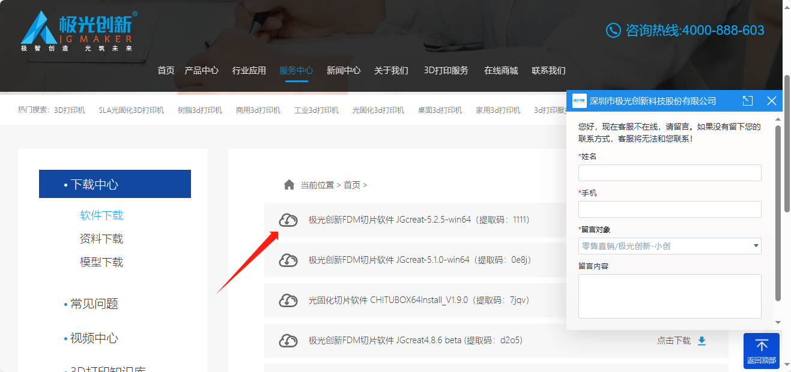
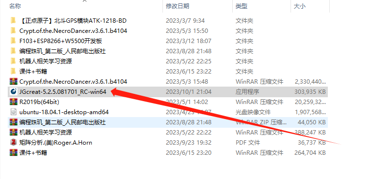
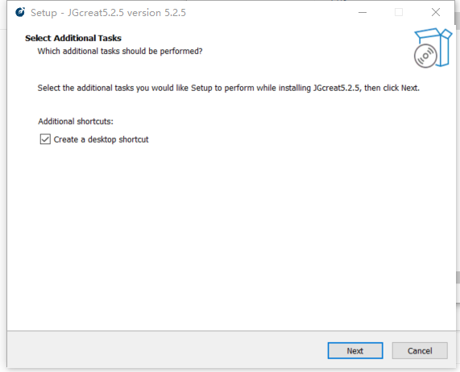
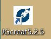
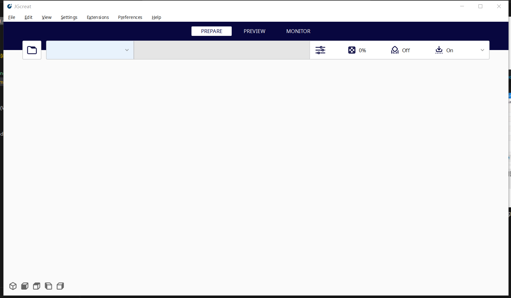
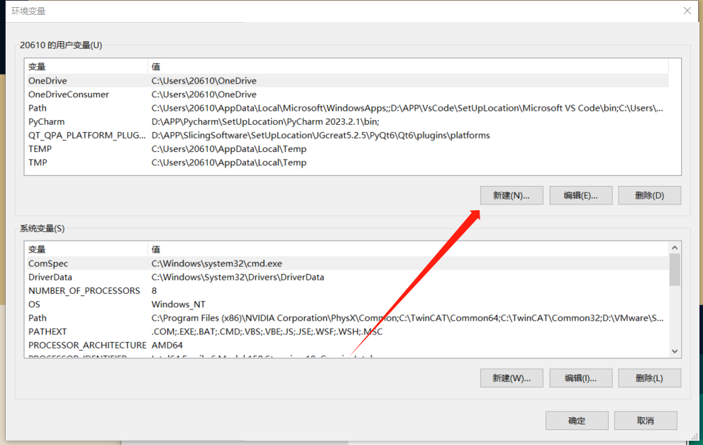
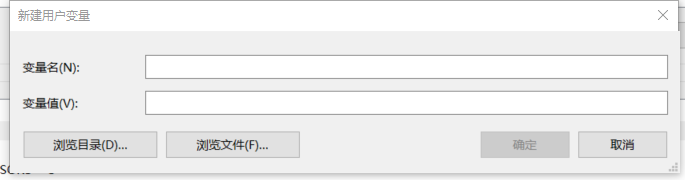
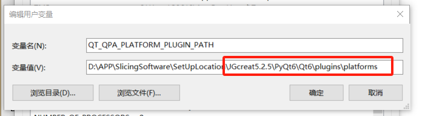

# 目录

[toc]

## 软件下载

### 1.进入官网

网址如下:<http://www.jgew3d.com/list-21.html>

网站界面如图所示

> * 选择第一个即可(切记:选择的是FDM切片软件，版本最新的即可)
> * 通过百度云下载即可

### 2.下载结果

## 软件安装

* 1.先新建一个安装文件夹
  
>找个合适的地方新建一个文件夹,如下图所示为我的安装路径

* 2.打开软件安装包

> 双击软件包，打开后如下图所示

* 3.点击Next

>点击browse，选择第一步中安装文件夹的路径

* 4.点击Next

>如图所示，进入下一步

* 5.点击Install
  
>等待安装完成

* 6.点击Finsh

> 可以看到桌面上多一个软件图标，如图所示

* 7.打开软件
  
> 双击图标，打开软件，如图所示，即成功安装

## 报错问题及解决方法

### 1.缺少环境变量

>安装完成后，打开软件时出现以下弹窗

#### 解决方法

##### 1.打开环境变量界面

>如何打开环境变量界面还请自行百度

##### 2.选择新建(N)

##### 3.填入变量名

>QT_QPA_PLATFORM_PLUGIN_PATH
>变量名是统一的

##### 4.填入变量值(V)

> * 单击浏览目录
> * 先找到软件安装的路径
> * 然后找到如下图红框所示部分的路径
> * 点击确定

##### 5.单击确定，即可

> 设置完环境变量后，可直接尝试打开软件，或者先重启电脑再打开
